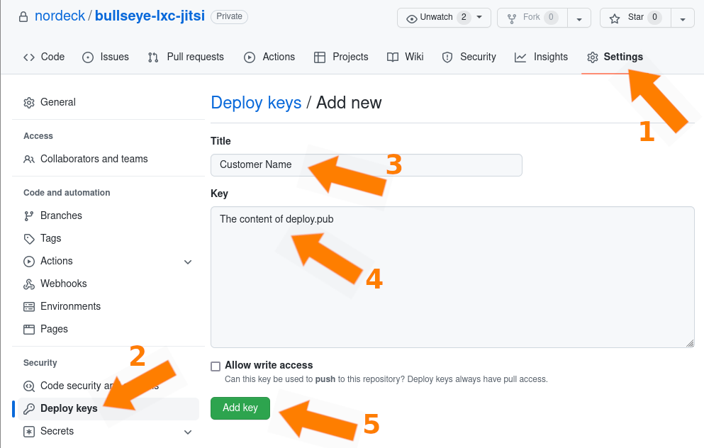

# Jitsi Cluster

`Jitsi` cluster based on `LXC`.

- [1. JMS (Jitsi Meet Server)](#1-jms-jitsi-meet-server)
  - [1.1 Prerequisites](#11-prerequisites)
    - [1.1.1 Supported distribution](#111-supported-distribution)
    - [1.1.2 Server specifications](#112-server-specifications)
    - [1.1.3 DNS records](#113-dns-records)
    - [1.1.4 Ports](#114-ports)
    - [1.1.5 Creating the deployment key](#115-creating-the-deployment-key)
  - [1.2 Installation](#12-installation)
    - [1.2.1 Login to the server](#121-login-to-the-server)
    - [1.2.2 Installer script](#122-installer-script)
    - [1.2.3 Installer config](#123-installer-config)
    - [1.2.4 Deployment key](#124-deployment-key)
    - [1.2.5 Running the installer](#125-running-the-installer)
- [2. Additional JVB (Jitsi Video Bridge)](#2-additional-jvb-jitsi-video-bridge)

## 1. JMS (Jitsi Meet Server)

The `JMS` server contains:

- `Jitsi-Meet` web interface\
  _published through `Nginx`_

- `Prosody`\
  _XMPP server_

- `Jicofo`\
  _Jitsi conference focus service_

- `TURN`

- `JVB`\
  _This service may be disabled if there are additional `JVBs`_

### 1.1 Prerequisites

#### 1.1.1 Supported distribution

`Debian 11 Bullseye`

#### 1.1.2 Server specifications

- At least 2 CPU cores
- At least 8 GB RAM
- At least 8 GB disk

#### 1.1.3 DNS records

- `DNS A record` for `JMS` which points this server\
  e.g. `jitsi.nordeck.corp`

- `DNS CNAME record` for `TURN` as an alias for `JMS`\
  e.g. `turn.nordeck.corp`

#### 1.1.4 Ports

- `TCP/443`

- `TCP/80`\
  _If Lets Encrypt is used_

- `TCP/5222`\
  _If there are additional `JVBs` or `Jibris` which access `JMS` through the
  public IP_

- `UDP/10000`\
  _If there is an enabled `JVB` on `JMS`_

#### 1.1.5 Creating the deployment key

Create a deployment key for each customer

```bash
ssh-keygen -t rsa -b 4096 -f jitsi-deploy-customer_name
```

Add the content of `jitsi-deploy-customer_name.pub` as a deployment key on
`GitHub`.



### 1.2 Installation

#### 1.2.1 Login to the server

Login to the server as `root` user

#### 1.2.2 Installer script

Download `ni`, the Nordeck Installer script

```bash
cd /root
wget -O ni https://raw.githubusercontent.com/nordeck/bullseye-lxc-base/main/installer/ni
```

#### 1.2.3 Installer config

Copy [nordeck-jitsi.conf](installer/nordeck-jitsi.conf) into `/root/` folder and
customize it if needed, For example add FQDNs into it:

```bash
echo export JITSI_FQDN=jitsi.nordeck.corp >>nordeck-jitsi.conf
echo export TURN_FQDN=turn.nordeck.corp >>nordeck-jitsi.conf
```

#### 1.2.4 Deployment key

Copy the private part of the deployment key into `/root/.ssh/` folder. Its name
must be `deploy.key`

```bash
cp jitsi-deploy-customer_name /root/.ssh/deploy.key
chmod 600 /root/.ssh/deploy.key
```

#### 1.2.5 Running the installer

Run the installer

```bash
cd /root
bash ni nordeck-jitsi
```

## 2. Additional JVB (Jitsi Video Bridge)

### 2.1 Prerequisites

#### 2.1.1 Supported distribution

`Debian 11 Bullseye`

#### 2.1.2 Server specifications

- At least 2 CPU cores
- At least 4 GB RAM
- At least 8 GB disk

#### 2.1.3 Ports

- `UDP/10000`

- `TCP/9090`\
  _The signaling port... This port must be accessible for `JMS`_
